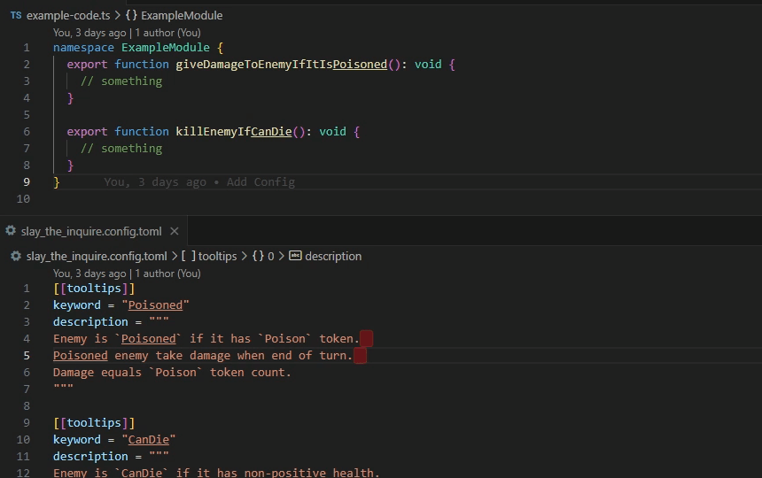

# slay-the-inquire README

WARN: This extension is experimental.

## Features

Add tooltip like [Slay the Spire](https://www.megacrit.com) to your code.

For example if there is an image subfolder under your extension project workspace:



## Requirements

Add config file at `<WorkspaceFolder>/slay_the_inquire.config.toml`

Like:

```toml
[[tooltips]]
keyword = "Poisoned"
description = """
Enemy is `Poisoned` if it has `Poison` token.  
Poisoned enemy take damage when end of turn.  
Damage equals `Poison` token count.
"""

[[tooltips]]
keyword = "CanDie"
description = """
Enemy is `CanDie` if it has non-positive health.
"""
```

## Extension Settings

Currently no setting.
